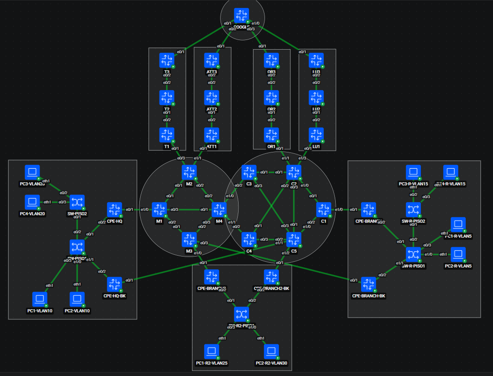
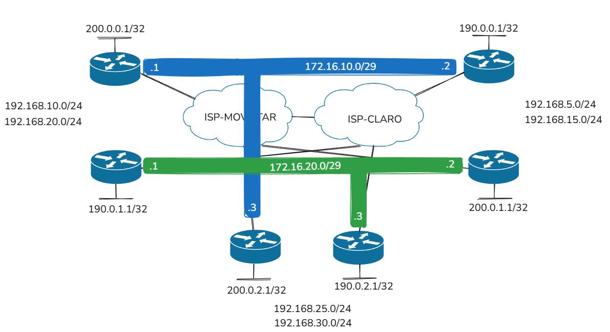

# UNIVERSIDAD NACIONAL DE INGENIERIA 
# CURSO - TLN03 - AUTOMATIZACIÓN Y PROGRAMABILIDAD DE REDES

## Descripción
Repositorio base para el curso Electivo TLN03 de la Universidad Nacional de Ingenieria.

## Topología Base

## Topología ISP - Branch2
Esta rama (`pc2-jhoveran-test`) extiende la topología base agregando la red Branch2, 
interconectada a través de ISP-Movistar e ISP-Claro.

## Tuneles DMVPN

## Direccionamiento Branch2

## Tecnologías
- Linux
- Docker
- Containerlab
- Cisco
- Python
- Ansible

## Configuraciones Base
Por desarrollar
